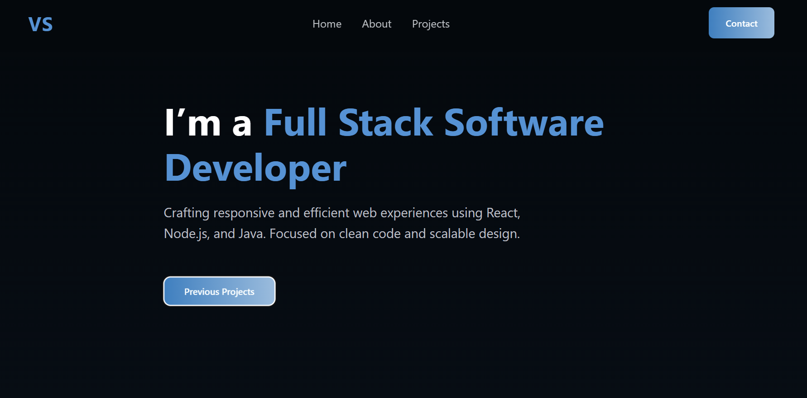

# 💼 Portfólio — Vinicius Santos 

Bem-vindo ao repositório do meu portfólio profissional!  
Este projeto foi desenvolvido com foco em **fluidez, design moderno e performance**, para apresentar meus **projetos, habilidades e contatos profissionais**.

---

## 🖥️ Preview



> *Demonstração do site completo — com transições suaves, seção de contato funcional e layout responsivo.*

🔗 **Acesse online:** [https://vinicius-santos-portfolio.vercel.app](https://vinicius-santos-portfolio.vercel.app)

---

## 🚀 Tecnologias Utilizadas

- ⚛️ **React.js** — estrutura principal da aplicação  
- 🎨 **CSS3 / Tailwind-like design system** — estilização e responsividade  
- 🧭 **Framer Motion** — animações fluidas entre seções  
- 📬 **EmailJS** — envio direto de mensagens via formulário de contato  
- 🧠 **React Scroll** — navegação fluida entre seções  
- 🔔 **React Hot Toast** — feedback visual moderno no envio de mensagens  

---

## 🧩 Estrutura das Seções

| Seção | Descrição |
|-------|------------|
| **Home** | Apresentação inicial e CTA “Previous Projects” |
| **About** | Mini bio com borda em profundidade e botões interativos (“Hire Me” e “Resume”) |
| **Portfolio** | Mostra projetos com animações e botões “Live Demo” e “Code” |
| **Services** | Habilidades e áreas de atuação como dev |
| **Contact** | Formulário funcional com EmailJS + footer com redes sociais |

---

## 📸 Destaques Visuais

- 💫 **Design escuro e elegante** (`#04080c` como base)  
- 🩵 **Paleta de cores:**  
  `#04080c`, `#3f7fbf`, `#9bbcdd`, `#7c7c7f`, `#bcbfc4`, `#FFFFFF`  
- 🔄 **Animações suaves e intuitivas** com Framer Motion  
- 🧱 **Layout responsivo** para desktop, tablet e mobile  

---

## 🧠 Funcionalidades

✅ Scroll suave entre seções  
✅ Efeitos de entrada animados  
✅ Formulário de contato com feedback visual  
✅ Links diretos para redes e GitHub  
✅ Favicon e identidade visual personalizada  

---

## 🛠️ Como Rodar Localmente

```bash
# Clonar o repositório
git clone https://github.com/zvini7/portfolio.git

# Entrar na pasta do projeto
cd portfolio

# Instalar as dependências
npm install

# Rodar o projeto localmente
npm start
